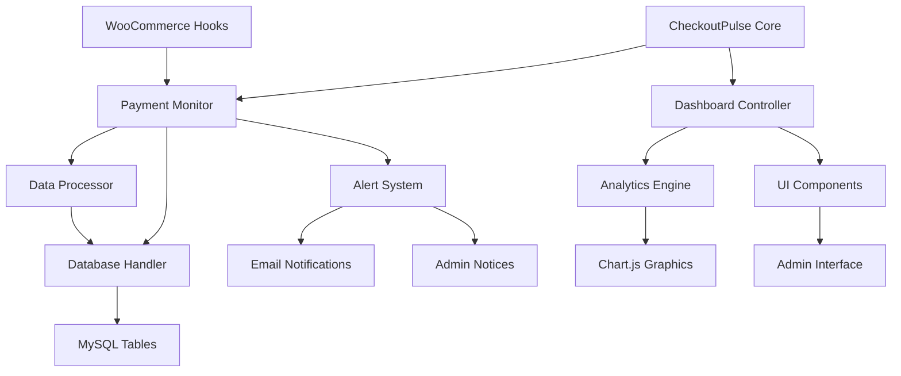
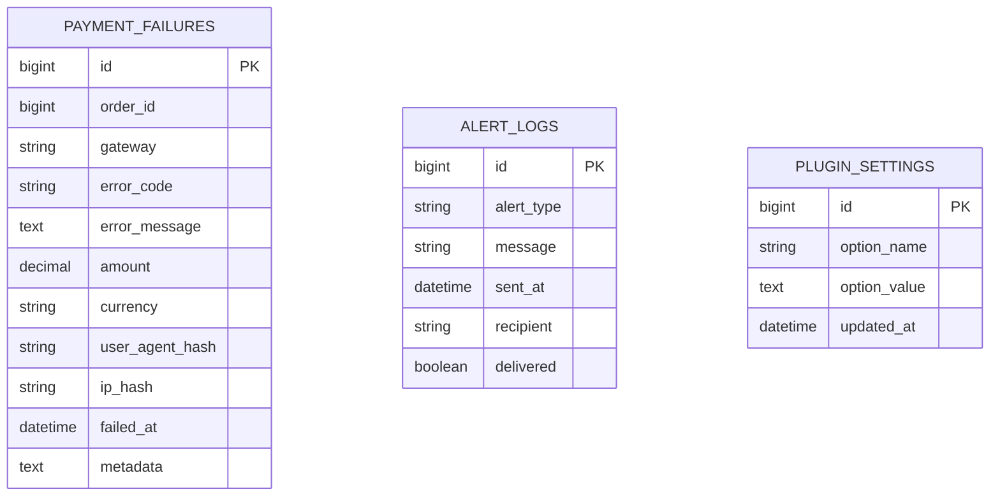
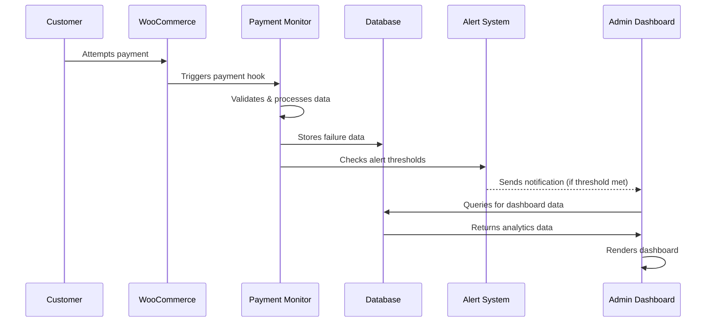
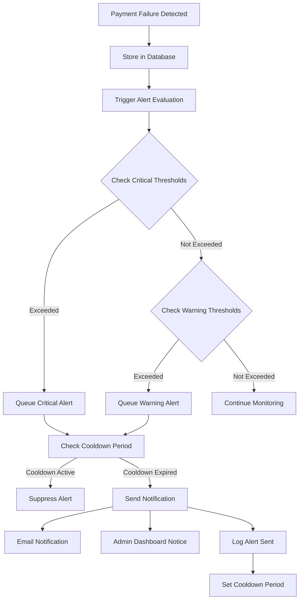
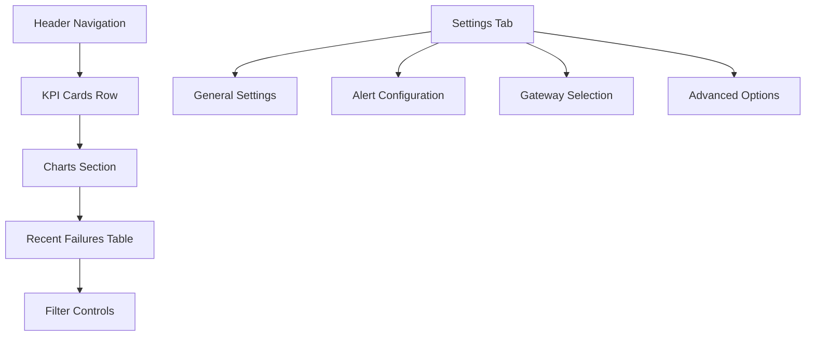

# 🏗️ CheckoutPulse AI - Detailed Architectural Plan

## 📊 Executive Summary

This plan outlines the development of a WordPress plugin that monitors WooCommerce payment failures and provides actionable insights through a comprehensive dashboard. The MVP will focus on core functionality with scalable architecture for future enhancements.

## 🎯 Project Objectives

1. **Monitor Payment Failures**: Capture 100% of WooCommerce payment failures automatically
2. **Provide Insights**: Deliver actionable analytics through an intuitive dashboard
3. **Alert System**: Notify administrators of critical payment issues
4. **Performance**: Maintain zero impact on checkout performance
5. **Compatibility**: Support WordPress 5.8+, WooCommerce 6.0+, PHP 8.0+

## 🏛️ System Architecture

### Core Architecture Pattern
The plugin follows the **Observer Pattern** with **Dependency Injection** for modularity and testability.



### Database Schema



## 📁 Refined File Structure

```
checkoutpulse-ai/
├── checkoutpulse-ai.php              # Main plugin file
├── readme.txt                        # WordPress.org readme
├── LICENSE                           # GPL v2 license
├── includes/
│   ├── class-checkoutpulse-core.php     # Main plugin class
│   ├── class-payment-monitor.php        # Hook handler & data capture
│   ├── class-database-manager.php       # Database operations
│   ├── class-alert-system.php           # Notification system
│   ├── class-dashboard-controller.php   # Admin interface controller
│   ├── class-analytics-engine.php       # Data processing & metrics
│   ├── class-settings-manager.php       # Configuration management
│   └── traits/
│       ├── trait-singleton.php          # Singleton pattern
│       └── trait-hooks.php              # Hook management
├── admin/
│   ├── css/
│   │   ├── admin-dashboard.css          # Dashboard styles
│   │   └── admin-settings.css           # Settings page styles
│   ├── js/
│   │   ├── dashboard-charts.js          # Chart.js implementation
│   │   ├── admin-settings.js            # Settings interactions
│   │   └── real-time-updates.js         # AJAX updates
│   └── partials/
│       ├── dashboard-main.php           # Main dashboard template
│       ├── dashboard-widgets.php        # KPI widgets
│       ├── settings-page.php            # Settings interface
│       └── failure-details-modal.php    # Failure detail popup
├── assets/
│   ├── images/
│   │   ├── icon-128x128.png            # Plugin icon
│   │   └── banner-1544x500.png         # WordPress.org banner
│   └── screenshots/                     # For WordPress.org
├── languages/
│   ├── checkoutpulse-ai.pot            # Translation template
│   └── checkoutpulse-ai-fr_FR.po       # French translation
├── tests/                              # Unit tests (future)
└── uninstall.php                       # Cleanup on uninstall
```

## 🔄 Data Flow Architecture



## 🚨 Alert System Architecture

### Alert Types & Thresholds

#### 1. **Critical Alerts** (Immediate Response Required)
```php
// Default thresholds (configurable)
CRITICAL_ALERTS = [
    'rapid_failures' => [
        'threshold' => 5,           // 5 failures
        'timeframe' => 600,         // in 10 minutes
        'cooldown' => 1800,         // 30 min cooldown
        'priority' => 'critical'
    ],
    'gateway_down' => [
        'threshold' => 3,           // 3 consecutive failures
        'timeframe' => 300,         // in 5 minutes
        'same_gateway' => true,     // Same payment gateway
        'priority' => 'critical'
    ],
    'high_value_failure' => [
        'threshold_amount' => 500,  // Orders > $500
        'consecutive' => 2,         // 2 consecutive high-value failures
        'priority' => 'critical'
    ]
];
```

#### 2. **Warning Alerts** (Attention Required)
```php
WARNING_ALERTS = [
    'elevated_failure_rate' => [
        'threshold_percentage' => 15,   // >15% failure rate
        'timeframe' => 3600,           // in 1 hour
        'minimum_attempts' => 10,      // Min 10 attempts to trigger
        'priority' => 'warning'
    ],
    'gateway_degradation' => [
        'threshold_percentage' => 25,   // >25% failure rate for specific gateway
        'timeframe' => 1800,           // in 30 minutes
        'minimum_attempts' => 5,       // Min 5 attempts
        'priority' => 'warning'
    ],
    'unusual_error_spike' => [
        'threshold' => 3,              // 3+ occurrences of same error
        'timeframe' => 1800,           // in 30 minutes
        'error_code_based' => true,    // Same error code
        'priority' => 'warning'
    ]
];
```

#### 3. **Informational Alerts** (Daily/Weekly Summary)
```php
INFO_ALERTS = [
    'daily_summary' => [
        'schedule' => 'daily',         // Send daily at 9 AM
        'time' => '09:00',
        'include_trends' => true,      // Include trend analysis
        'priority' => 'info'
    ],
    'weekly_report' => [
        'schedule' => 'weekly',        // Send weekly on Monday
        'day' => 'monday',
        'time' => '09:00',
        'detailed_analysis' => true,   // Include detailed analytics
        'priority' => 'info'
    ]
];
```

### Alert Processing Flow



### Notification Mechanisms

#### 1. **Email Notifications**
```php
// Email template structure
EMAIL_TEMPLATES = [
    'critical' => [
        'subject' => '[URGENT] Payment System Alert - {site_name}',
        'template' => 'critical-alert-email.php',
        'priority' => 'high',
        'format' => 'html'
    ],
    'warning' => [
        'subject' => '[Warning] Payment Issues Detected - {site_name}',
        'template' => 'warning-alert-email.php',
        'priority' => 'normal',
        'format' => 'html'
    ],
    'summary' => [
        'subject' => 'Daily Payment Summary - {site_name}',
        'template' => 'daily-summary-email.php',
        'priority' => 'low',
        'format' => 'html'
    ]
];

// Email content includes:
// - Alert type and severity
// - Specific failure details
// - Impact analysis (lost revenue)
// - Recommended actions
// - Direct links to dashboard
// - Quick action buttons (if applicable)
```

#### 2. **Admin Dashboard Notices**
```php
// Notice types and persistence
ADMIN_NOTICES = [
    'critical' => [
        'type' => 'error',
        'dismissible' => false,        // Cannot be dismissed
        'persistent' => true,          // Stays until resolved
        'pages' => ['all_admin'],      // Show on all admin pages
        'auto_refresh' => 30           // Refresh every 30 seconds
    ],
    'warning' => [
        'type' => 'warning',
        'dismissible' => true,         // Can be dismissed
        'persistent' => false,         // Dismissed after 24h
        'pages' => ['woocommerce'],    // Only on WooCommerce pages
        'auto_refresh' => 300          // Refresh every 5 minutes
    ]
];
```

#### 3. **Real-time Dashboard Updates**
```javascript
// WebSocket-style updates for dashboard
const alertSystem = {
    pollInterval: 30000,              // 30 seconds
    endpoints: {
        critical: '/wp-admin/admin-ajax.php?action=cp_check_critical',
        warnings: '/wp-admin/admin-ajax.php?action=cp_check_warnings',
        summary: '/wp-admin/admin-ajax.php?action=cp_get_summary'
    },
    
    // Visual indicators
    updateBadges: function(alertCount) {
        // Update menu badge counts
        // Flash notifications
        // Sound alerts (configurable)
    }
};
```

### Alert Configuration Interface

#### Settings Panel Structure
```php
// Admin settings organization
ALERT_SETTINGS_TABS = [
    'thresholds' => [
        'label' => 'Alert Thresholds',
        'fields' => [
            'critical_failure_count',
            'critical_timeframe',
            'warning_failure_rate',
            'high_value_threshold'
        ]
    ],
    'notifications' => [
        'label' => 'Notification Settings',
        'fields' => [
            'email_recipients',
            'email_frequency',
            'admin_notices_enabled',
            'sound_alerts_enabled'
        ]
    ],
    'schedule' => [
        'label' => 'Scheduled Reports',
        'fields' => [
            'daily_summary_enabled',
            'daily_summary_time',
            'weekly_report_enabled',
            'weekly_report_day'
        ]
    ],
    'advanced' => [
        'label' => 'Advanced Options',
        'fields' => [
            'cooldown_periods',
            'alert_retention_days',
            'custom_webhooks',
            'integration_settings'
        ]
    ]
];
```

### Smart Alert Features

#### 1. **Adaptive Thresholds**
```php
// Machine learning-lite approach
class AdaptiveThresholds {
    public function calculateDynamicThreshold($historical_data, $current_period) {
        // Calculate rolling average
        $baseline = $this->calculateBaseline($historical_data);
        
        // Adjust for time of day/week patterns
        $seasonal_factor = $this->getSeasonalFactor($current_period);
        
        // Apply growth trend compensation
        $trend_factor = $this->getTrendFactor($historical_data);
        
        return $baseline * $seasonal_factor * $trend_factor;
    }
}
```

#### 2. **Alert Grouping & Deduplication**
```php
// Prevent alert spam
class AlertGrouping {
    public function shouldSendAlert($new_alert, $recent_alerts) {
        // Group similar alerts within timeframe
        $similar_alerts = $this->findSimilarAlerts($new_alert, $recent_alerts);
        
        if (count($similar_alerts) > 0) {
            // Update existing alert instead of creating new one
            return $this->updateAlertGroup($similar_alerts, $new_alert);
        }
        
        return true; // Send new alert
    }
}
```

#### 3. **Escalation Procedures**
```php
// Progressive alert escalation
ESCALATION_RULES = [
    'level_1' => [
        'timeframe' => 900,        // 15 minutes
        'recipients' => ['shop_manager'],
        'channels' => ['email', 'dashboard']
    ],
    'level_2' => [
        'timeframe' => 1800,       // 30 minutes (if unresolved)
        'recipients' => ['shop_manager', 'administrator'],
        'channels' => ['email', 'dashboard', 'sms']  // Future: SMS integration
    ],
    'level_3' => [
        'timeframe' => 3600,       // 1 hour (if still unresolved)
        'recipients' => ['administrator', 'developer'],
        'channels' => ['email', 'dashboard', 'slack'] // Future: Slack integration
    ]
];
```

## 🎨 User Interface Architecture

### Dashboard Layout


### Component Hierarchy
- **Main Dashboard**: Overview with KPIs and trends
- **Detailed Analytics**: Deep-dive charts and filters  
- **Settings Panel**: Configuration management
- **Alert Management**: Notification preferences
- **Export Tools**: Data export functionality

## 🔌 Integration Points

### WooCommerce Hooks Strategy
```php
// Primary monitoring hooks
add_action('woocommerce_payment_complete', [$this, 'track_success'], 10, 1);
add_action('woocommerce_order_status_failed', [$this, 'capture_failure'], 10, 1);
add_action('woocommerce_checkout_order_processed', [$this, 'track_attempt'], 10, 3);

// Gateway-specific hooks
add_action('woocommerce_gateway_paypal_return', [$this, 'track_paypal_return'], 10, 2);
add_action('wc_stripe_payment_error', [$this, 'capture_stripe_error'], 10, 2);

// HPOS compatibility
add_action('woocommerce_new_order', [$this, 'track_order_creation'], 10, 1);
```

### Performance Optimization Strategy
- **Async Processing**: Queue heavy operations
- **Database Indexing**: Optimized queries for analytics
- **Caching**: WordPress transients for dashboard data
- **Lazy Loading**: Load dashboard components on demand

## 🚀 Development Phases

### Phase 1: Core Foundation (Week 1-2)
1. **Plugin Structure Setup**
   - Main plugin file with proper headers
   - Core class architecture implementation
   - Database table creation
   - Basic activation/deactivation hooks

2. **Payment Monitoring Core**
   - WooCommerce hook integration
   - Data capture and validation
   - Database storage implementation
   - Basic error handling

### Phase 2: Dashboard & Analytics (Week 3-4)
1. **Admin Interface**
   - Dashboard page creation
   - KPI widgets implementation
   - Basic chart integration (Chart.js)
   - Settings page structure

2. **Analytics Engine**
   - Data aggregation functions
   - Trend calculation algorithms
   - Performance metrics computation
   - Export functionality basics

### Phase 3: Alert System (Week 5)
1. **Notification System**
   - Email alert implementation
   - Threshold monitoring
   - Admin notice system
   - Alert frequency management

2. **Configuration Management**
   - Settings validation
   - Gateway selection interface
   - Alert customization options
   - Data retention settings

### Phase 4: Testing & Optimization (Week 6)
1. **Compatibility Testing**
   - WordPress/WooCommerce versions
   - Payment gateway testing
   - Theme compatibility
   - Performance benchmarking

2. **Security & Polish**
   - Security audit and fixes
   - Code optimization
   - Documentation completion
   - Translation preparation

## 🔒 Security Implementation

### Data Protection Strategy
- **Input Sanitization**: All user inputs sanitized using WordPress functions
- **Output Escaping**: All outputs escaped (esc_html, esc_attr, esc_url)
- **Nonce Verification**: CSRF protection on all admin actions
- **Capability Checks**: Proper user permission verification
- **Data Anonymization**: Hash sensitive data (IP, user agent)

### Security Checklist
- [ ] SQL injection prevention (prepared statements)
- [ ] XSS prevention (output escaping)
- [ ] CSRF protection (nonces)
- [ ] File upload security (if applicable)
- [ ] Direct file access prevention
- [ ] Database prefix usage
- [ ] Secure option storage

## 📊 Performance Targets

### Benchmarks
- **Checkout Impact**: <50ms additional processing time
- **Dashboard Load**: <2 seconds initial load
- **Database Queries**: <10 queries per dashboard page
- **Memory Usage**: <16MB additional memory consumption
- **Storage**: Efficient data compression and archiving

## 🧪 Testing Strategy

### Manual Testing Scenarios
1. **Payment Failure Simulation**
   - Test card decline scenarios
   - Gateway timeout simulations
   - Network error conditions
   - Invalid payment method scenarios

2. **Dashboard Functionality**
   - Data accuracy verification
   - Chart rendering tests
   - Filter functionality
   - Export feature validation

3. **Alert System Testing**
   - Threshold trigger verification
   - Email delivery confirmation
   - Alert frequency compliance
   - Notification content accuracy

### Automated Testing (Future Enhancement)
- Unit tests for core classes
- Integration tests for WooCommerce hooks
- Performance tests for database operations
- Security tests for input validation

## 📈 Success Metrics

### MVP Acceptance Criteria
- [ ] Captures 100% of payment failures
- [ ] Dashboard loads in <3 seconds
- [ ] Zero checkout performance impact
- [ ] Compatible with target gateways
- [ ] Proper email alert functionality
- [ ] WordPress coding standards compliance
- [ ] Security audit completion

### Business Metrics
- **User Engagement**: Dashboard daily active usage
- **Problem Resolution**: Time to identify payment issues
- **Revenue Recovery**: Insights leading to recovered sales
- **User Satisfaction**: Beta tester feedback scores

## 🔄 Future Roadmap (Post-MVP)

### Phase 5: Advanced Analytics
- Machine learning failure prediction
- Customer segmentation analysis
- Revenue impact calculations
- A/B testing for recovery strategies

### Phase 6: Integration Expansion
- Third-party gateway support
- CRM integration capabilities
- Email marketing platform connections
- Analytics platform exports

### Phase 7: Enterprise Features
- Multi-site network support
- White-label customization
- Advanced reporting suite
- API access for external tools

---

This comprehensive plan provides a solid foundation for developing the CheckoutPulse AI plugin MVP while maintaining scalability for future enhancements. The architecture emphasizes WordPress best practices, security, and performance optimization with a sophisticated alert system that provides actionable insights to store owners.